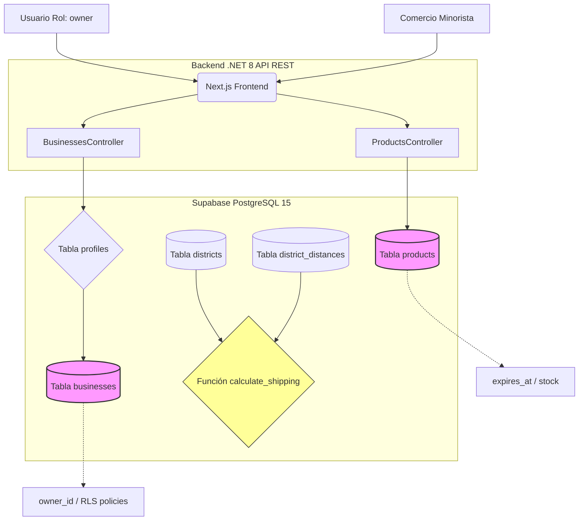

# ComeYa! — Documentación Técnica

Plataforma de rescate alimentario que conecta comercios con consumidores para recuperar alimentos próximos a vencer. Sistema distribuido con frontend en Next.js 14, API en .NET 8 bajo Clean Architecture, y base de datos PostgreSQL en Supabase con Row Level Security.

---

## 1. Visión General de Arquitectura

```
┌─────────────────────────────────────────────────────────────────────┐
│                        CLIENTE (Navegador)                          │
│  Next.js 14 · React 18 · Tailwind CSS · Framer Motion               │
│  React Query (caché + refetch) · Supabase JS Client (auth + RT)     │
└──────────┬──────────────────────┬───────────────────────────────────┘
           │ REST (JSON + JWT)    │ WebSocket (Realtime)
           ▼                      ▼
┌──────────────────────┐  ┌───────────────────────────────────────────┐
│   .NET 8 Web API     │  │              SUPABASE                     │
│   (Render)           │  │  ┌─────────────┐  ┌──────────────────┐   │
│                      │  │  │ Auth (GoTrue)│  │ PostgreSQL 15    │   │
│  ┌────────────────┐  │  │  │ JWT issuer   │  │ · RLS policies   │   │
│  │ Controllers    │  │  │  │ email/pass   │  │ · Triggers (8)   │   │
│  │ (REST endpoints)│  │  │  └─────────────┘  │ · Functions       │   │
│  └───────┬────────┘  │  │                    │ · Realtime subs   │   │
│  ┌───────┴────────┐  │  │                    └──────────────────┘   │
│  │ Application    │  │  └───────────────────────────────────────────┘
│  │ (MediatR/CQRS) │  │
│  └───────┬────────┘  │
│  ┌───────┴────────┐  │
│  │ Infrastructure │  │
│  │ (EF Core/Npgsql)│──┼────────────▶ Base de datos (SQL sobre SSL)
│  │ (JWT validation)│  │
│  └────────────────┘  │
└──────────────────────┘
```

**Tres canales de comunicación:**
1. **Frontend → API REST**: peticiones HTTP con JWT en header `Authorization: Bearer`, JSON en cuerpo. Manejo de cold start del backend (Render free tier, ~30–60 s).
2. **Frontend → Supabase Auth**: autenticación directa contra GoTrue para login/registro/sesión.
3. **Frontend → Supabase Realtime**: suscripciones WebSocket para chat, notificaciones y cambios de estado de pedidos (sin pasar por el backend).

---

## 2. Fases del Modelo de Negocio y su Implementación Técnica

El sistema se estructura en cinco fases que representan el ciclo completo del producto, desde la entrada de datos hasta la medición de impacto. Cada fase se vincula con los componentes técnicos ya construidos.

### Fase 1: Suministro e Información (Entrada de Datos)

Registro digitalizado de comercios minoristas asociados (panaderías, cafeterías, grocerías), control sistematizado de stocks, geolocalización en tiempo real y fechas de expiración.

| Requisito de negocio | Implementación técnica | Ubicación |
|---|---|---|
| Registro de comercios | Tabla `businesses` + endpoint `POST /api/businesses`. El trigger `on_auth_user_created` crea automáticamente el negocio al registrarse un usuario con rol `owner`. RLS: solo el dueño modifica su negocio. | `BusinessesController.cs` · `003_functions_triggers.sql` |
| Control de stock | Tabla `products` con campo `stock`. El trigger `on_order_item_created` descuenta stock automáticamente al comprar. El trigger `on_order_cancelled` lo restaura. | `products.stock` · triggers #4 y #7 |
| Geolocalización | Tabla `districts` con 10 distritos de Lima + `district_distances` con matriz de 45 pares de distancias en km. La función `calculate_shipping()` determina el costo de envío según la distancia entre distritos. | `seed/districts.sql` · `001_initial_schema.sql` |
| Fechas de expiración | Campo `expires_at` en `products`. Propiedades computadas en `Product.cs`: `DiscountPercentage` (mayor descuento al acercarse el vencimiento), `IsExpired`, `HoursUntilExpiry`. El endpoint GET filtra automáticamente productos expirados. | `Product.cs` · `ProductRepository.cs` |

### Fase 2: Núcleo Digital y Aprendizaje (Procesamiento)

Procesamiento de información para apoyar la toma de decisiones del negocio. Como ComeYa se encuentra en una etapa inicial y todavía no cuenta con suficiente historial propio de ventas, esta fase partirá de una base de datos externa o histórica tomada de negocios similares: panaderías, cafeterías, minimarkets o tiendas de alimentos que venden productos próximos a vencer con descuentos.

Ese dataset inicial servirá como referencia para analizar patrones de precio, descuento, demanda por categoría, horario de compra, distrito y cercanía al vencimiento. A partir de esos datos, el sistema podrá construir estimaciones preliminares para recomendar estrategias de venta dentro de la plataforma.

El enfoque técnico será progresivo: primero se usará información histórica externa para entrenar, validar o calibrar modelos preliminares; luego, conforme los clientes compren dentro de ComeYa, los datos reales de `products`, `orders`, `order_items`, descuentos aplicados y horarios de compra alimentarán el modelo propio. De esta forma, la plataforma iniciará con conocimiento de referencia y evolucionará hacia aprendizaje basado en comportamiento real.

| Requisito de negocio | Implementación técnica | Ubicación |
|---|---|---|
| Predicción de demanda | Uso inicial de una base histórica externa de negocios similares para entrenar o validar un modelo preliminar. El modelo estimará probabilidad de venta considerando categoría del producto, precio, descuento, horario, distrito y cercanía a `products.expires_at`. Posteriormente, se reemplazará o ajustará con datos propios de ComeYa. | Dataset externo · `products` · `orders` · `order_items` |
| Precios dinámicos | Análisis de descuentos históricos según tipo de producto, tiempo restante antes del vencimiento, zona y comportamiento de compra. Con esa información, el sistema podrá sugerir descuentos moderados cuando falte más tiempo y descuentos mayores cuando el vencimiento esté próximo. | `products.original_price` · `products.price` · `products.expires_at` |
| Visualización de resultados | Panel administrativo para mostrar métricas comparativas entre estimaciones iniciales, recomendaciones de descuento y ventas reales generadas por la plataforma. El negocio podrá revisar si las recomendaciones ayudan a vender antes del vencimiento. | `app/admin/page.jsx` · futuros endpoints de analítica |
| Aprendizaje progresivo | Los pedidos creados, productos vendidos, descuentos usados, horarios de compra, distritos y estados finales de los pedidos se almacenarán como nuevo historial para recalibrar el modelo. Mientras más se use ComeYa, mejores serán las recomendaciones de demanda y precio. | `orders` · `order_items` · `products` · `user_stats` |

### Fase 3: Ejecución y Canales (Consumo y Logística)

#### Fase 3A — Canal de Consumo

El usuario accede a compras aceleradas mediante proximidad y certificados de calidad digitales.

| Requisito de negocio | Implementación técnica | Ubicación |
|---|---|---|
| Compra por proximidad | El endpoint `GET /api/products` acepta filtro `?district=` y ordena por `expires_at ASC`. La página `/shop` agrupa productos por negocio y permite filtrar por distrito. Los cupones (`coupons`) aplican descuentos adicionales validados por la función `validate_coupon()`. | `ProductsController.cs` · `app/shop/page.jsx` · `001_initial_schema.sql` |
| Checkout acelerado | Flujo en `/cart` → `POST /api/orders`. El endpoint agrupa items por `business_id` y crea una orden por negocio. Validación de stock, cálculo de shipping por distancia de distritos, y aplicación de cupón en una sola llamada. | `OrdersController.cs` · `app/cart/page.jsx` |
| Certificados de calidad digitales | Cada producto tiene trazabilidad: `business_id` → dueño verificado, `expires_at` → frescura garantizada, `original_price` → descuento visible. Los cupones (`coupons`) actúan como certificados de confianza con condiciones transparentes (membresía requerida, compra mínima, usos disponibles). | `products` + `coupons` + `businesses` |

#### Fase 3B — Canal Logístico

Ejecución de entregas rápidas a través de micromovilidad sostenible (cargo bikes y scooters eléctricos).

| Requisito de negocio | Implementación técnica | Ubicación |
|---|---|---|
| Asignación por zona | Los pedidos se asignan al negocio más cercano según el distrito del cliente. La matriz `district_distances` y la función `get_distance()` calculan la distancia entre cualquier par de distritos. | `seed/districts.sql` · `get_distance()` |
| Seguimiento en tiempo real | State machine de 5 estados (`pending → confirmed → preparing → onway → delivered`). El trigger `on_order_status_notify` envía notificaciones al cliente en cada transición. React Query hace polling cada 10–30 s para reflejar cambios sin recargar la página. | `003_functions_triggers.sql` (#6) · `useOrders.js` |
| Entregas sostenibles | El sistema de shipping (`calculate_shipping()`) modela entregas por tramos de distancia compatibles con micromovilidad: ≤10 km, ≤25 km, >25 km. La tabla `user_stats` mide el CO2 evitado como métrica de impacto ambiental del canal logístico. | `calculate_shipping()` · `user_stats.co2_avoided` |

### Fase 4: Bucle de Datos para el Aprendizaje

Monitoreo constante del desempeño real del mercado para alimentar los algoritmos de predicción y reentrenar el modelo recursivamente.

| Requisito de negocio | Implementación técnica | Ubicación |
|---|---|---|
| Tasa de conversión | Cada orden creada (`orders`) descuenta stock (`products.stock`) y registra uso de cupón (`coupon_usage`). El trigger `on_order_status_changed` acumula métricas en `user_stats` solo cuando la orden llega a `delivered`, asegurando que solo se cuenten conversiones reales. | `orders` · `order_items` · `003_functions_triggers.sql` (#5) |
| Tasa de rotación | Los timestamps `created_at` y `expires_at` en `products` permiten calcular la velocidad de venta por producto y categoría. El campo `stock` refleja la rotación en tiempo real (descuento por compra, restauración por cancelación). | `products` · triggers #4 y #7 |
| Reentrenamiento recursivo | Las métricas de `user_stats` (comidas rescatadas, dinero ahorrado, CO2 evitado) y el historial de `orders` + `order_items` constituyen el dataset de entrenamiento. Un pipeline offline (Python/Colab) consume exports periódicos de estas tablas para reentrenar los modelos de Fase 2, cerrando el bucle de aprendizaje. | `user_stats` · `orders` · `order_items` |

### Fase 5: Resultados y Valor Realizado (Impacto)

Consolidación de métricas que demuestran la recuperación del margen de ganancia de los negocios y la reducción medible de residuos orgánicos.

| Requisito de negocio | Implementación técnica | Ubicación |
|---|---|---|
| Recuperación del margen comercial | `user_stats.money_saved` acumula la diferencia entre `original_price` y `price` por cada producto vendido. Cada orden entregada dispara el trigger `update_user_stats_on_delivery()` que calcula: `SUM((original_price - price) * quantity)` para el cliente y `SUM(price * quantity)` como ingreso para el negocio. | `003_functions_triggers.sql` (#5) · `UserStats.cs` |
| Reducción de residuos orgánicos | `user_stats.meals_rescued` cuenta cada producto comprado que habría sido desechado. `user_stats.co2_avoided` estima el CO2 equivalente evitado (`quantity * 0.5 kg CO2e por producto`). Ambas métricas se agregan por usuario y están disponibles vía `GET /api/profile`. | `UserStats.cs` · `ProfileController.cs` |
| Panel de impacto público | La landing page y el perfil de usuario muestran métricas acumuladas: kg de alimentos rescatados, S/ ahorrados por los consumidores, kg de CO2 evitados, y total de órdenes completadas. Estos valores se obtienen del endpoint de perfil y se renderizan con animaciones de conteo. | `app/page.jsx` · `app/profile/page.jsx` |

---

## 3. Stack Tecnológico

| Capa | Tecnología | Justificación |
|------|-----------|---------------|
| **Frontend** | Next.js 14 (App Router) | SSR + rutas basadas en archivos. Despliegue gratuito en Vercel. |
| **Estilos** | Tailwind CSS + Framer Motion | Utilidades atómicas con animaciones declarativas. Tema `brand.*` personalizado. |
| **Estado del servidor** | TanStack React Query v5 | Caché, invalidación, refetch polling para pedidos en tiempo real. |
| **Autenticación** | Supabase Auth (GoTrue) | JWT con HS256. Manejo de sesión en frontend vía `@supabase/supabase-js`. |
| **Backend** | .NET 8 Web API | Alto rendimiento, tipado fuerte, ecosistema maduro. Despliegue en Render. |
| **Arquitectura** | Clean Architecture + CQRS | Separación de responsabilidades en 4 capas. MediatR para commands/queries. |
| **ORM** | Entity Framework Core 8 + Npgsql | Mapeo objeto-relacional con proveedor PostgreSQL. Migraciones code-first. |
| **Validación** | FluentValidation | Validación declarativa de requests en la capa de aplicación. |
| **Base de datos** | Supabase (PostgreSQL 15) | Base relacional con RLS, triggers, funciones y suscripciones en tiempo real. |
| **Logs** | Serilog | Structured logging con sink de consola para Render. |
| **Documentación** | Swashbuckle (Swagger) | OpenAPI spec autogenerada. Swagger UI en `/swagger`. |

---

## 4. Flujo de Datos y Ciclo de Vida de una Petición

### 4.1 Flujo de Lectura (GET /api/products)

```
Navegador                         Frontend                              Backend (.NET)                     Supabase
   │                                │                                      │                                  │
   │  renderiza /shop               │                                      │                                  │
   │ ──────────────────────────────▶│                                      │                                  │
   │                                │  useProducts(params)                 │                                  │
   │                                │  React Query: cache miss             │                                  │
   │                                │  api.get('/products?category=...')   │                                  │
   │                                │ ────────────────────────────────────▶│                                  │
   │                                │                                      │  [AuthMiddleware]                │
   │                                │                                      │  (público, sin token requerido)   │
   │                                │                                      │  ProductsController.GetProducts   │
   │                                │                                      │  ProductRepository                │
   │                                │                                      │  .GetActiveProductsAsync()        │
   │                                │                                      │ ─────────────────────────────────▶│
   │                                │                                      │                                  │  SELECT p.*, b.*
   │                                │                                      │                                  │  FROM products p
   │                                │                                      │                                  │  JOIN businesses b
   │                                │                                      │                                  │  WHERE p.is_active
   │                                │                                      │                                  │    AND p.expires_at > NOW()
   │                                │                                      │                                  │    AND b.is_active
   │                                │                                      │                                  │  ORDER BY p.expires_at ASC
   │                                │                                      │                                  │
   │                                │                                      │  ◀───────────────────────────────│  List<Product>
   │                                │                                      │                                  │
   │                                │  ◀───────────────────────────────────│  200 OK [{id, name, price...}]
   │                                │                                      │                                  │
   │                                │  React Query: guarda en caché        │                                  │
   │                                │  queryKey: ['products', params]      │                                  │
   │                                │  staleTime: 5 min                    │                                  │
   │                                │                                      │                                  │
   │  ◀─────────────────────────────│  renderiza grid de productos         │                                  │
```

### 4.2 Flujo de Escritura (POST /api/orders)

```
Navegador                         Frontend                              Backend (.NET)                     Supabase
   │                                │                                      │                                  │
   │  confirma carrito              │                                      │                                  │
   │ ──────────────────────────────▶│                                      │                                  │
   │                                │  useCreateOrder().mutate({items})    │                                  │
   │                                │  React Query: mutation               │                                  │
   │                                │  api.post('/orders', body)           │                                  │
   │                                │ ────────────────────────────────────▶│                                  │
   │                                │                                      │  [AuthMiddleware]                │
   │                                │                                      │  ── valida JWT (issuer + expiry) │
   │                                │                                      │  ── extrae sub → userId           │
   │                                │                                      │  ── extrae role → customer/owner  │
   │                                │                                      │                                  │
   │                                │                                      │  OrdersController.CreateOrder     │
   │                                │                                      │  ── agrupa items por business_id │
   │                                │                                      │  ── por cada grupo:               │
   │                                │                                      │     · valida stock disponible     │
   │                                │                                      │     · calcula subtotal            │
   │                                │                                      │     · calcula shipping (distrito) │
   │                                │                                      │     · valida cupón (si aplica)    │
   │                                │                                      │     · crea Order + OrderItems     │
   │                                │                                      │  OrderRepository.AddAsync()       │
   │                                │                                      │ ─────────────────────────────────▶│
   │                                │                                      │                                  │  ┌─ INSERT INTO orders
   │                                │                                      │                                  │  ├─ INSERT INTO order_items
   │                                │                                      │                                  │  ├─ TRIGGER: reduce_product_stock()
   │                                │                                      │                                  │  ├─ TRIGGER: increment_coupon_usage()
   │                                │                                      │  └─ TRIGGER: create_initial_order_message()
   │                                │                                      │  ◀───────────────────────────────│  Order creado
   │                                │                                      │                                  │
   │                                │  ◀───────────────────────────────────│  201 Created [{ order }]          │
   │                                │                                      │                                  │
   │                                │  React Query: invalidate(['orders']) │                                  │
   │                                │  React Query: refetch automático     │                                  │
   │                                │                                      │                                  │
   │  ◀─────────────────────────────│  redirige a /orders                  │                                  │
```

---

## 5. Arquitectura del Backend (.NET 8)

### 5.1 Clean Architecture — 4 Capas

```
┌──────────────────────────────────────────────────────────────────┐
│                    ComeYa.API (Capa de Presentación)              │
│  · Controllers REST (Products, Orders, Profile, Businesses)       │
│  · Program.cs: pipeline de middlewares                            │
│  · JWT Authentication (validación de issuer, sin authority URL)   │
│  · CORS para frontend                                             │
│  · Swagger/OpenAPI                                                │
└────────────┬─────────────────────────────────────────────────────┘
             │ depende de
┌────────────▼─────────────────────────────────────────────────────┐
│                  ComeYa.Application (Capa de Aplicación)           │
│  · Interfaces de repositorios (IProductRepository, etc.)         │
│  · ICurrentUserService (abstracción del usuario autenticado)      │
│  · MediatR (registrado, handlers pendientes de implementar)       │
│  · FluentValidation (validadores de requests)                     │
│  · DTOs y lógica de casos de uso                                 │
└────────────┬─────────────────────────────────────────────────────┘
             │ depende de
┌────────────▼─────────────────────────────────────────────────────┐
│                   ComeYa.Domain (Capa de Dominio)                  │
│  · Entidades: Profile, Business, Product, Order, OrderItem,      │
│    Coupon, Message, Complaint, Notification, UserStats,          │
│    PaymentCard, ComplaintResponse                                 │
│  · Enums: UserRole, ProductCategory, OrderStatus, PaymentMethod,  │
│    Membership                                                     │
│  · BaseEntity (Id, CreatedAt, UpdatedAt)                          │
│  · Propiedades computadas: DiscountPercentage, IsExpired,         │
│    HoursUntilExpiry, CanBeCancelled, Subtotal, IsValid            │
│  · SIN dependencias externas                                      │
└────────────┬─────────────────────────────────────────────────────┘
             │ depende de
┌────────────▼─────────────────────────────────────────────────────┐
│               ComeYa.Infrastructure (Capa de Infraestructura)      │
│  · ComeYaDbContext: 12 DbSets, snake_case mapping, FK config      │
│  · Repositorios: Product, Business, Order, Profile                │
│  · CurrentUserService: extracción de claims JWT                   │
│  · Conexión Npgsql a Supabase (Pooler, SSL)                      │
└──────────────────────────────────────────────────────────────────┘
```

**Regla de dependencia:** Las capas internas no conocen las externas. Domain no referencia ningún paquete NuGet externo. Application solo referencia Domain. Infrastructure implementa las interfaces definidas en Application.

### 5.2 Pipeline de Middlewares (Program.cs)

```
Request entrante
    │
    ▼
┌─────────────────────────┐
│ 1. Serilog Request Logging │  ── Structured logging desde el entry point
└────────────┬────────────┘
             ▼
┌─────────────────────────┐
│ 2. CORS Middleware        │  ── Permite origin del frontend (localhost:3000 / Vercel)
└────────────┬────────────┘  ── AllowCredentials() para JWT en cookies si se requiere
             ▼
┌─────────────────────────┐
│ 3. Authentication (JWT)   │  ── JwtBearer: valida issuer = Supabase URL
└────────────┬────────────┘  ── SignatureValidator custom (bypass HS256 verification,
             ▼                  confía en que Supabase ya validó el token)
┌─────────────────────────┐
│ 4. Authorization          │  ── [Authorize] attribute en controllers/endpoints
└────────────┬────────────┘
             ▼
┌─────────────────────────┐
│ 5. Controller             │  ── Model binding + validación
└────────────┬────────────┘
             ▼
┌─────────────────────────┐
│ 6. Repository → EF Core   │  ── LINQ → SQL (Npgsql)
└────────────┬────────────┘
             ▼
┌─────────────────────────┐
│ 7. Supabase PostgreSQL    │  ── RLS + triggers se ejecutan del lado del servidor
└─────────────────────────┘
```

### 5.3 Validación JWT

El backend valida tokens emitidos por Supabase Auth con la siguiente configuración:

- **Issuer**: configurado al URL del proyecto Supabase (`https://<project>.supabase.co`)
- **Audience**: no se valida (`ValidateAudience = false`)
- **Signature**: se usa un `SignatureValidator` delegado que simplemente parsea el JWT sin verificar la firma criptográfica. Supabase usa HS256 con un secreto compartido que no es práctico distribuir al backend. La confianza se delega en Supabase: si el token llegó al cliente, GoTrue ya lo validó.
- **Claims mapeados**: `sub` → `NameIdentifier` (UserId), `email` → email, `role` → role

### 5.4 Conexión a Base de Datos

```
Backend (.NET)                         Supabase
    │                                     │
    │  Npgsql sobre SSL                   │
    │  Host: aws-1-us-east-1.pooler       │
    │       .supabase.com                 │
    │  Port: 6543 (Pooler, no 5432)       │
    │  SSL Mode: Require                  │
    │  Timeout: 30s                        │
    │  Command Timeout: 60s               │
    │  Keepalive: 30s                     │
    │────────────────────────────────────▶│  PgBouncer (pool de conexiones)
    │                                     │        │
    │                                     │        ▼
    │                                     │  PostgreSQL 15
    │                                     │  · RLS activo por tabla
    │                                     │  · 8 triggers automatizados
    │                                     │  · Realtime via WAL
```

Se usa el **Pooler de Supabase** (puerto 6543) en lugar de la conexión directa (5432) por dos razones:
1. Manejo de pool de conexiones con PgBouncer, crítico en serverless/containers donde las conexiones se crean y destruyen frecuentemente.
2. El formato de conexión directa (`db.<project>.supabase.co`) requiere resolución DNS que falla en algunos entornos (error `SocketException 11004`). El Pooler usa un dominio más estable.

---

## 6. Arquitectura del Frontend (Next.js 14)

### 6.1 Estructura de Proveedores (Providers)

```
app/layout.jsx
    │
    └── app/providers.jsx
            │
            ├── QueryProvider        ← TanStack React Query (caché global)
            │     │
            │     └── AuthProvider   ← Supabase Auth (sesión + perfil)
            │           │
            │           └── StoreProvider  ← [LEGACY] Context para carrito
            │                 │
            │                 └── {children} (páginas)
```

### 6.2 Ciclo de Autenticación

```
1. APP INICIA
   providers.jsx monta AuthProvider
        │
        ▼
2. VERIFICAR SESIÓN EXISTENTE
   supabase.auth.getSession()
        │
        ├── (sin sesión) ──────────▶ user = null, profile = null, loading = false
        │                            ── páginas públicas accesibles
        │                            ── páginas protegidas redirigen a /login
        │
        └── (con sesión)
              │
              ▼
3. CARGAR PERFIL DESDE DB
   supabase.from('profiles')
     .select('*, businesses(id)')
     .eq('id', user.id)
     .single()
        │
        ├── (perfil encontrado) ──▶ profile = { fullName, role, district, businessId, ... }
        │
        └── (perfil no encontrado)
              ── fallback: construye perfil desde user.user_metadata
              ── profile = { email, role: metadata.role, fullName: metadata.full_name }
              ── el trigger on_auth_user_created debió crear el perfil en la DB
              ── si no existe, es un error de configuración de Supabase
        │
        ▼
4. SUSCRIPCIÓN A CAMBIOS DE AUTENTICACIÓN
   supabase.auth.onAuthStateChange((event, session) => {
     if (event === 'SIGNED_OUT') → user = null, profile = null
     if (event === 'SIGNED_IN' || 'TOKEN_REFRESHED') → recargar perfil
   })
```

### 6.3 Capa de API Client

```
Página/Componente
    │
    ▼
React Query Hook (useProducts, useOrders, useProfile)
    │  ── useQuery / useMutation
    │  ── onSuccess → queryClient.invalidateQueries([...])
    │
    ▼
API Module (productsApi, ordersApi, profileApi, businessesApi)
    │  ── productsApi.getAll(params)
    │  ── productsApi.create(data)
    │
    ▼
apiFetch(endpoint, options)  ← lib/api/client.js
    │  ── obtiene token JWT: getAccessToken()
    │  ── AbortController con timeout de 60s (cold start)
    │  ── headers: { Authorization: Bearer <token> }
    │  ── fetch(API_BASE + endpoint, options)
    │
    ├── OK (2xx) ──────────▶ retorna JSON
    ├── 204 ───────────────▶ retorna null
    ├── AbortError ────────▶ throw ColdStartError
    └── Error (4xx/5xx) ──▶ throw ApiError(status, message)
```

**Manejo de cold start (Render free tier):**
- Timeout configurable: `COLD_START_TIMEOUT = 60000` (60 segundos)
- Si el backend está "dormido", Render tarda 30–60 s en iniciar el contenedor.
- `ApiLoading` muestra spinner durante la espera, y un mensaje amigable si expira el timeout.
- React Query tiene `retry: 3` específicamente para `ColdStartError`, con backoff exponencial.

### 6.4 React Query — Estrategia de Caché

| Hook | queryKey | staleTime | Refetch Interval | Estrategia |
|------|----------|-----------|------------------|------------|
| `useProducts` | `['products', params]` | 5 min | — | Caché por filtros. Invalidación en mutaciones. |
| `useProduct(id)` | `['product', id]` | 5 min | — | Habilitado solo si `id` existe. |
| `useOrders` | `['orders']` | 0 | **30 s (polling)** | Refetch constante para cambios de estado. |
| `useOrder(id)` | `['order', id]` | 0 | **10 s (polling)** | Refetch frecuente para tracking en tiempo real. |
| `useProfile` | `['profile']` | 5 min | — | Caché de perfil. Invalidación en update. |

**Mutaciones** (`useMutation`): al ejecutarse con éxito, invalidan los queryKeys relacionados para forzar refetch automático.

---

## 7. Arquitectura de Base de Datos (Supabase PostgreSQL)

### 7.1 Esquema Relacional

```
┌──────────────┐       ┌──────────────┐
│   profiles   │       │   districts  │
│  (extiende   │       │   · name     │
│  auth.users) │       │   · is_active│
│  · role      │       └──────┬───────┘
│  · district  │              │
│  · membership│              │ (solo referencia textual,
│  · avatar_url│              │  sin FK rígida)
└──┬─────┬─────┘              │
   │     │                    │
   │     ├────────────────────┘
   │     │
   │     │ 1:1 ┌──────────────┐
   │     ├─────│  user_stats  │
   │     │     │  · meals_    │
   │     │     │    rescued   │
   │     │     │  · money_    │
   │     │     │    saved     │
   │     │     │  · co2_      │
   │     │     │    avoided   │
   │     │     └──────────────┘
   │     │
   │     │ 1:N ┌──────────────┐      ┌──────────────┐      ┌──────────────┐
   │     ├─────│   orders     │──────│  order_items │──────│   products   │
   │     │     │  · status    │1:N   │  · qty       │N:1   │  · name      │
   │     │     │  · subtotal  │      │  · price     │      │  · category  │
   │     │     │  · shipping  │      └──────────────┘      │  · price     │
   │     │     │  · coupon    │                            │  · stock     │
   │     │     └──────┬───────┘                            │  · expires_at│
   │     │            │                                    └──────┬───────┘
   │     │            │ 1:N ┌──────────────┐                      │
   │     │            ├─────│   messages   │                      │
   │     │            │     │  · content   │                      │
   │     │            │     │  · sender_role│                     │
   │     │            │     │  · is_read   │                      │
   │     │            │     └──────────────┘                      │
   │     │            │                                           │
   │     │            │ 1:1 ┌──────────────┐                      │
   │     │            └─────│  complaints  │                      │
   │     │                  │  · category  │                      │
   │     │                  │  · status    │                      │
   │     │                  └──────┬───────┘                      │
   │     │                         │ 1:N                          │
   │     │                         └─────▶ complaint_responses    │
   │     │                                                       │
   │     │ 1:1 ┌──────────────┐          ┌──────────────┐        │
   │     ├─────│  businesses  │──────────│   products   │────────┘
   │     │     │  · owner_id  │1:N       └──────────────┘
   │     │     │  · name      │
   │     │     │  · rating    │
   │     │     └──────────────┘
   │     │
   │     │ 1:N ┌──────────────┐
   │     ├─────│ notifications│
   │     │     │  · type      │
   │     │     │  · is_read   │
   │     │     └──────────────┘
   │     │
   │     │ 1:N ┌──────────────┐
   │     └─────│payment_cards │
   │           │  · last_four │
   │           │  · brand     │
   │           └──────────────┘
   │
   │ N:M ┌──────────────┐      ┌──────────────┐
   └─────│ coupons      │──────│ coupon_usage │
         │  · code      │      │  · user_id   │
         │  · discount% │      │  · order_id  │
         └──────────────┘      └──────────────┘
```

**13 tablas de datos + 2 tablas de soporte (`districts`, `district_distances`).** Todas usan UUID como primary key, snake_case en columnas, y heredan timestamps `created_at`/`updated_at`.

### 7.2 Row Level Security (RLS)

RLS habilitado en las **15 tablas**. Cada política sigue el principio de mínimo privilegio:

| Tabla | SELECT | INSERT | UPDATE | DELETE |
|-------|--------|--------|--------|--------|
| `profiles` | Propio perfil; dueños de negocio ven clientes que les compraron | — | Solo propio perfil | — |
| `businesses` | Negocios activos (público); propio negocio (owner) | Solo rol `owner` | Solo propio negocio | Solo propio negocio |
| `products` | Activos + no expirados (público); todos los del negocio (owner) | Owner del negocio | Owner del negocio | Owner del negocio |
| `orders` | Propios (cliente); los de su negocio (owner) | Solo rol `customer` | Owner actualiza status; cliente cancela solo `pending` | — |
| `order_items` | Participante de la orden | Cliente de la orden | — | — |
| `messages` | Participante de la orden | Participante de la orden | Receptor marca como leído | — |
| `notifications` | Propias | — (vía triggers) | Propia (marcar leída) | Propia |
| `user_stats` | Propias | — (vía triggers) | — (vía triggers) | — |
| `payment_cards` | Propias | Propias | Propias | Propias |
| `coupons` | Activos y válidos (público) | — (admin) | — (admin) | — (admin) |

### 7.3 Triggers de Automatización

8 triggers implementan la lógica de negocio del lado del servidor:

| # | Trigger | Evento | Acción |
|---|---------|--------|--------|
| 1 | `on_auth_user_created` | AFTER INSERT en `auth.users` | Crea fila en `profiles`, `user_stats`, y opcionalmente `businesses` si `role=owner` |
| 2 | `on_order_created` | AFTER INSERT en `orders` | Envía mensaje de bienvenida automático del dueño al cliente |
| 3 | `on_order_with_coupon` | AFTER INSERT en `orders` | Incrementa `coupons.current_uses` y registra en `coupon_usage` |
| 4 | `on_order_item_created` | AFTER INSERT en `order_items` | Reduce `products.stock` según cantidad comprada |
| 5 | `on_order_status_changed` | AFTER UPDATE de `status` en `orders` | Al llegar a `delivered`: calcula y actualiza `user_stats` (comidas rescatadas, dinero ahorrado, CO2 evitado) |
| 6 | `on_order_status_notify` | AFTER UPDATE de `status` en `orders` | Notifica al cliente en cada cambio de estado |
| 7 | `on_order_cancelled` | AFTER UPDATE de `status` a `cancelled` en `orders` | Restaura stock de todos los `order_items` |
| 8 | `on_message_created` | AFTER INSERT en `messages` | Notifica al destinatario con preview del mensaje (primeros 50 caracteres) |

### 7.4 Ciclo de Vida de una Orden (State Machine)

```
                    ┌──────────┐
                    │ pending  │  ← estado inicial al crear orden
                    └────┬─────┘
                         │
              ┌──────────┼──────────┐
              │          │          │
              ▼          ▼          │
         confirmed   cancelled      │  ← solo el cliente puede cancelar en estado pending
              │                     │
              ▼                     │
         preparing                  │
              │                     │
              ▼                     │
           onway                    │
              │                     │
              ▼                     │
         delivered ───────────▶ stats actualizadas (trigger)
                                 notificación enviada (trigger)
```

---

## 8. Seguridad

### 8.1 Autenticación

- **Frontend → Supabase Auth**: login/registro con email + contraseña. Supabase GoTrue emite JWT (HS256) con claims: `sub`, `email`, `role`, `aud`, `exp`.
- **Frontend → Backend**: JWT enviado en header `Authorization: Bearer <token>` en cada petición.
- **Backend**: valida issuer y expiry del JWT. No se valida firma criptográfica (HS256), delegando la confianza en Supabase.

### 8.2 Autorización

- **A nivel de API**: atributo `[Authorize]` en controladores/endpoints que requieren autenticación.
- **A nivel de base de datos**: RLS asegura que un usuario autenticado solo acceda a sus propios datos, incluso si el backend tiene una conexión con privilegios elevados. Defensa en profundidad.
- **A nivel de frontend**: guards en páginas que redirigen a `/login` si `!isAuthenticated`. Admin redirige si `profile.role !== 'owner'`.

### 8.3 Protección de Datos Sensibles

- Contraseñas: nunca almacenadas en el backend. Gestionadas exclusivamente por Supabase Auth.
- Tarjetas de pago: solo se almacenan últimos 4 dígitos, marca y fecha de expiración. Sin CVV ni número completo.
- Conexión a base de datos: SSL obligatorio (`SSL Mode=Require`).

---

## 9. Despliegue

```
┌──────────────────────────────────────────────────────────────────┐
│                        ENTORNO DE PRODUCCIÓN                      │
│                                                                    │
│  ┌──────────────────────┐   ┌──────────────────────┐              │
│  │    VERCEL (CDN)      │   │   RENDER (Docker)    │              │
│  │                      │   │                      │              │
│  │  Next.js 14          │   │  .NET 8 API           │              │
│  │  · Static + SSR      │──▶│  · Contenedor Docker  │              │
│  │  · Dominio:          │   │  · Free tier:         │              │
│  │    comeya.vercel.app │   │    cold start 30-60s  │              │
│  │  · Auto-deploy       │   │  · Puerto: 8080       │              │
│  │    desde GitHub      │   │  · Health check: /    │              │
│  └──────────────────────┘   └──────────┬───────────┘              │
│                                         │                          │
│  ┌──────────────────────┐              │                          │
│  │      SUPABASE        │              │                          │
│  │                      │◀─────────────┘                          │
│  │  · Auth (GoTrue)     │                                         │
│  │  · PostgreSQL 15     │                                         │
│  │  · Realtime (WAL)    │                                         │
│  │  · Free tier:        │                                         │
│  │    500 MB, 2 GB RAM  │                                         │
│  │    se pausa tras     │                                         │
│  │    inactividad       │                                         │
│  └──────────────────────┘                                         │
└──────────────────────────────────────────────────────────────────┘
```

### 9.1 Variables de Entorno por Entorno

| Variable | Desarrollo | Producción (Render) |
|----------|-----------|---------------------|
| `Supabase__Url` | `https://<project>.supabase.co` | Igual |
| `Supabase__AnonKey` | anon key de desarrollo | Anon key de producción |
| `ConnectionStrings__Supabase` | Pooler local (6543) | Pooler producción (6543) |
| `Frontend__Url` | `http://localhost:3000` | `https://comeya.vercel.app` |
| `ASPNETCORE_ENVIRONMENT` | `Development` | `Production` |

### 9.2 Dockerfile (Backend)

Build multi-etapa:
1. **Etapa `build`**: `mcr.microsoft.com/dotnet/sdk:8.0` — restaura, compila y publica `ComeYa.API` en modo Release.
2. **Etapa `runtime`**: `mcr.microsoft.com/dotnet/aspnet:8.0` — solo el runtime, imagen final ligera.
3. **Puerto expuesto**: 8080 (Render inyecta `PORT=8080`).
4. **Entrypoint**: `dotnet ComeYa.API.dll`.

---

## 10. Convenciones del Proyecto

| Categoría | Convención |
|-----------|-----------|
| **Idioma** | UI y comentarios en español. Código (nombres de variables, clases, métodos) en inglés. |
| **Frontend** | `.jsx` / `.js` sin TypeScript. Alias `@/*` → raíz del proyecto. Componentes cliente con `'use client'`. |
| **Backend** | C# 12 con nullable enabled. Clean Architecture (Domain → Application → Infrastructure → API). |
| **Base de datos** | Tablas y columnas en `snake_case`. Enums como strings. UUIDs como PKs. Timestamps `created_at`/`updated_at` en todas las tablas. |
| **Commits** | Sin secretos. Variables de entorno en `.env.local` (gitignored). |
| **Testing** | Backend: `dotnet test`. Frontend: `npm run build` como verificación de compilación. |

---

## 11. Estructura del Monorepo

```
ComeYa/
├── frontend/                       # Next.js 14
│   ├── app/                        # App Router — 12 páginas
│   │   ├── layout.jsx              # Root layout + Providers + Footer + Toast
│   │   ├── providers.jsx           # QueryProvider > AuthProvider > StoreProvider
│   │   ├── page.jsx                # Landing page (pública)
│   │   ├── login/page.jsx          # Supabase Auth login
│   │   ├── register/page.jsx       # Supabase Auth registro con selección de rol
│   │   ├── shop/page.jsx           # Catálogo de productos con filtros (autenticada)
│   │   ├── cart/page.jsx           # Carrito + creación de órdenes (autenticada)
│   │   ├── orders/page.jsx         # Tracking de pedidos con polling (autenticada)
│   │   ├── profile/page.jsx        # Edición de perfil + upgrade premium (autenticada)
│   │   ├── admin/page.jsx          # CRUD de productos (solo owner)
│   │   ├── complaints/page.jsx     # Formulario de reclamos (autenticada)
│   │   ├── privacidad/page.jsx     # Política de privacidad (estática)
│   │   └── terminos/page.jsx       # Términos y condiciones (estática)
│   ├── components/                 # 7 componentes UI compartidos
│   │   ├── Nav.jsx                 # Barra de navegación con enlaces + campana de notificaciones
│   │   ├── Card.jsx                # Tarjeta glass con animación Framer Motion
│   │   ├── HomeSection.jsx         # Sección animada al hacer scroll
│   │   ├── ApiLoading.jsx          # Estados de carga/error + ColdStartBanner
│   │   ├── Footer.jsx              # Footer global con enlaces
│   │   ├── NotificationBell.jsx    # Campana + dropdown de notificaciones
│   │   └── Toast.jsx               # Sistema de toast via custom events
│   └── lib/
│       ├── api/                    # Capa de cliente HTTP
│       │   ├── client.js           # apiFetch() + manejo de JWT y cold start
│       │   ├── products.js         # productsApi
│       │   ├── orders.js           # ordersApi
│       │   ├── profile.js          # profileApi
│       │   └── businesses.js       # businessesApi
│       ├── hooks/                  # React Query hooks
│       │   ├── query-provider.js   # QueryClientProvider con retry config
│       │   ├── useProducts.js      # useProducts, useProduct, create/update/delete
│       │   ├── useOrders.js        # useOrders, useOrder, create/cancel
│       │   └── useProfile.js       # useProfile, update, upgrade
│       ├── supabase/               # Integración Supabase
│       │   ├── client.js           # Cliente JS + getAccessToken()
│       │   ├── auth-context.js     # AuthProvider + useAuth() (sesión + perfil)
│       │   └── realtime.js         # useRealtimeMessages/Notifications/OrderStatus
│       ├── store.js                # [LEGACY] Carrito vía localStorage (en migración)
│       └── auth.js                 # [DEPRECATED] Sistema de auth anterior
│
├── backend/                        # .NET 8 Web API
│   ├── ComeYa.slnx                 # Solución con 4 proyectos
│   ├── Dockerfile                  # Build multi-etapa para Render
│   ├── render.yaml                 # Config de despliegue en Render
│   └── src/
│       ├── ComeYa.API/             # Capa de presentación (Controllers + Program.cs)
│       │   ├── Program.cs          # Pipeline de middlewares (Serilog, CORS, JWT, Swagger)
│       │   ├── Controllers/
│       │   │   ├── ProductsController.cs   # CRUD productos + filtros
│       │   │   ├── OrdersController.cs     # CRUD órdenes + cambio de estado + cancelación
│       │   │   ├── ProfileController.cs    # GET/PUT perfil + upgrade premium
│       │   │   └── BusinessesController.cs # CRUD negocios + consulta pública
│       │   ├── appsettings.json            # Template de configuración
│       │   └── appsettings.Development.json # Configuración de desarrollo
│       │
│       ├── ComeYa.Application/     # Capa de aplicación (interfaces + casos de uso)
│       │   ├── DependencyInjection.cs       # Registro de MediatR + FluentValidation
│       │   └── Common/Interfaces/
│       │       ├── IProductRepository.cs
│       │       ├── IBusinessRepository.cs
│       │       ├── IOrderRepository.cs
│       │       ├── IProfileRepository.cs
│       │       └── ICurrentUserService.cs
│       │
│       ├── ComeYa.Domain/         # Capa de dominio (entidades + enums)
│       │   ├── Common/BaseEntity.cs
│       │   ├── Enums/              # UserRole, ProductCategory, OrderStatus, PaymentMethod, Membership
│       │   └── Entities/           # 12 entidades con propiedades computadas
│       │
│       └── ComeYa.Infrastructure/  # Capa de infraestructura (EF Core + auth)
│           ├── DependencyInjection.cs
│           ├── Auth/CurrentUserService.cs  # Extracción de claims JWT
│           └── Persistence/
│               ├── ComeYaDbContext.cs      # 12 DbSets, snake_case mapping, FK config
│               ├── ProductRepository.cs
│               ├── BusinessRepository.cs
│               ├── OrderRepository.cs
│               └── ProfileRepository.cs
│
├── database/                       # SQL (Supabase PostgreSQL)
│   ├── migrations/
│   │   ├── 001_initial_schema.sql     # 13 tablas + 2 soporte + índices + funciones helper
│   │   ├── 002_rls_policies.sql       # RLS en 15 tablas con políticas granulares
│   │   └── 003_functions_triggers.sql # 8 triggers de automatización + funciones
│   └── seed/
│       ├── districts.sql              # 10 distritos de Lima + matriz de distancias
│       ├── coupons.sql                # 5 cupones de descuento iniciales
│       ├── products.sql               # 8 productos de prueba
│       └── create-admin-user.sql      # Script manual para promover usuario a owner
│
└── docs/
    ├── API.md                     # Documentación de endpoints
    └── SUPABASE_SETUP.md          # Guía de configuración de Supabase
```

---

## 12. Comandos

```bash
# Frontend
cd frontend
npm install            # Instalar dependencias
npm run dev            # Servidor de desarrollo (puerto 3000)
npm run build          # Build de producción (verificación)
npm run lint           # ESLint

# Backend
cd backend
dotnet restore         # Restaurar paquetes NuGet
dotnet build           # Compilar solución
dotnet run --project src/ComeYa.API   # Ejecutar API (puerto 5000)
dotnet test            # Ejecutar tests

# Base de datos
# Ejecutar migraciones en orden en el SQL Editor de Supabase:
#   001_initial_schema.sql → 002_rls_policies.sql → 003_functions_triggers.sql
# Ejecutar seed data:
#   districts.sql → coupons.sql → products.sql
```

---

## 13. Documentación Adicional

- [Documentación de API](docs/API.md) — endpoints, parámetros, respuestas y códigos de error.
- [Guía de configuración de Supabase](docs/SUPABASE_SETUP.md) — creación del proyecto, migraciones, RLS y variables de entorno.



```mermaid
graph TD
    %% Componente de Machine Learning
    subgraph Aprendizaje Machine Learning - Python/Colab
        A[Modelo entrenado offline] --> B((Datos Estáticos))
        C[Pipeline de reentrenamiento] -.-> A
    end

    %% Núcleo Digital
    subgraph Núcleo Digital .NET 8 Clean Architecture
        subgraph ComeYa.Application
            D[MediatR CQRS]
            E[Commands/Handlers scaffolded]
            F[Queries/Handlers scaffolded]
        end
        
        subgraph ComeYa.Domain
            G[Entidad Product.cs]
        end
    end

    %% Consumo y Visualización
    subgraph Frontend / Ejecución
        H[Panel Admin /admin]
        I[Lógica de Precios Dinámicos]
    end

    %% Flujos de Datos
    B --> H
    D --> E
    D --> F
    G -.-> J[original_price vs price]
    G -.-> K[Propiedad DiscountPercentage]
    K --> I
    E -.-> I
